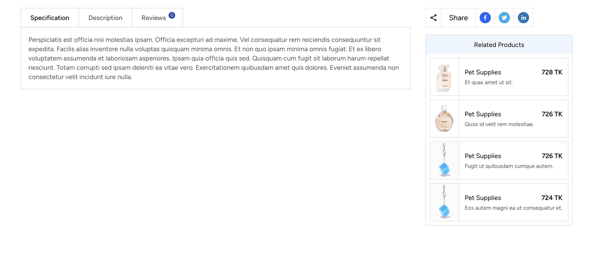

# Shove - E-commerce Platform

Shove is an e-commerce platform built using Laravel, ReactJS, and Tailwind CSS. This project is under development and is created purely for fun and learning purposes, not for production use.

## Overview

Shove aims to be a full-featured e-commerce platform where users can browse and search for products, add products to their cart, and make purchases.

**Note**: This project is not complete and is not intended to be used in production.

---

## Table of Contents

- [Technologies Used](#technologies-used)
- [Installation](#installation)
- [Usage](#usage)
- [Screenshots](#screenshots)
- [License](#license)

---

## Features

- **Product Catalog**: Browse products, which can belong to categories and subcategories.
- **Product Variants**: Products can have variants (e.g., size, color).
- **Attributes & Brands**: Products can be tagged with attributes and brand names.
- **Full-text Search**: Integrated with Laravel Scout for full-text search functionality.
- **Responsive Design**: Styled using Tailwind CSS for a modern, responsive interface.

---

## Technologies Used

- **Laravel**: Back-end framework for managing data and API creation.
- **ReactJS**: Front-end JavaScript library for building user interfaces.
- **Tailwind CSS**: Utility-first CSS framework for styling.
- **Laravel Scout**: Full-text search with Eloquent using [Laravel Scout](https://laravel.com/docs/11.x/scout).

---

## Installation

To get started with Shove, follow these steps:

1. Clone the repository:

   ```bash
   git clone https://github.com/saidurbhuiyan/shove.git
   cd shove
   ```

2. Install Laravel dependencies:

   ```bash
   composer install
   ```

3. Install NPM dependencies:
   ```bash
   npm install
   ```

4. Set up the environment file:

   ```bash
   cp .env.example .env
   ```
   Configure your .env file with the necessary database and environment details.

5. Run migrations:

   ```bash
   php artisan migrate
   ```

6. Start the development server:

   ```bash
   php artisan serve
   npm run dev
   ```

---

## Usage
Once the project is running, you can access the application at: 
```bash
http://localhost:8000
or
http://127.0.0.1:8000
```
You can browse the products, view them by category or search using the full-text search functionality provided by Laravel Scout.

---

## Screenshots
Homepage


Product View



Product Search

Category and Search Results


---

## License
This project is licensed under the MIT License - see the LICENSE file for details.

---
## Contributing
Contributions are welcome! Feel free to open issues or submit pull requests for improvements or new features.

---

## Disclaimer
Shove is a project created for fun and is not ready for production use. It's an educational project to learn and experiment with Laravel, ReactJS, and Tailwind CSS.

---
